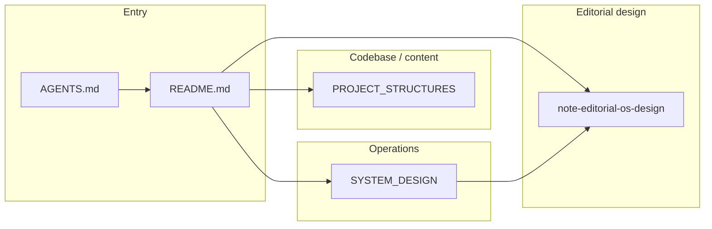

# notebook — docs index

> **Role:** project doc catalog · **Entry:** [`AGENTS.md`](../AGENTS.md) (`CLAUDE.md` → symlink)

## Doc map

## Catalog

| File | Role | Read when | Agent keywords |
|------|------|-----------|----------------|
| [`SYSTEM_DESIGN.md`](SYSTEM_DESIGN.md) | **Architecture** — 編集OSの境界とデータ流 | 方針・境界を触るとき | note, editorial, markdown |
| [`PROJECT_STRUCTURES.md`](PROJECT_STRUCTURES.md) | **File map** — profile/drafts 等 | ファイルを探す・追加するとき | profile, drafts, prompts |
| [`specs/2026-07-30-note-editorial-os-design.md`](specs/2026-07-30-note-editorial-os-design.md) | **Design** — 編集戦略ロック | 記事方針・柱・抽象化 | pillars, privacy, note |

### Ownership rules (no duplication)

| Topic | Canonical doc | Never duplicate in |
|-------|---------------|-------------------|
| Directory layout & paths | `PROJECT_STRUCTURES.md` | `SYSTEM_DESIGN.md` |
| 編集OS境界・データ流 | `SYSTEM_DESIGN.md` | `PROJECT_STRUCTURES.md` |
| 編集戦略・柱・プライバシー方針 | `specs/2026-07-30-note-editorial-os-design.md` | 散発メモ |
| 週次フローの使い方 | `AGENTS.md` | 長文を SYSTEM_DESIGN に再掲 |

## Read order

1. [`PROJECT_STRUCTURES.md`](PROJECT_STRUCTURES.md) — where content lives
2. [`SYSTEM_DESIGN.md`](SYSTEM_DESIGN.md) — editorial OS boundaries
3. [`specs/2026-07-30-note-editorial-os-design.md`](specs/2026-07-30-note-editorial-os-design.md) — locked strategy
4. Content dirs: `profile/` → `editorial/` → `drafts/`

## Folders

- **`specs/`** — brainstorming design specs. Index: [`specs/`](specs/).
- **`plans/`** — plan files. Registry: [`PLANS.md`](PLANS.md).
- **`_archive/`** — superseded docs. Do not link from living docs.
