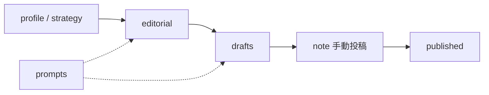

# notebook — System Design

> Architecture overview. File layout lives in [`PROJECT_STRUCTURES.md`](PROJECT_STRUCTURES.md).

## Purpose

[ぶあ＠タイ人と国際結婚](https://note.com/bua_thai) の **編集長兼ライターOS**。
ネタ出し〜下書き〜推敲〜公開メモを、このリポの markdown に資産化する。
読者は note 上。システム直接利用者は発行人本人。

## Architecture

- **正本:** Git 上の markdown
- **対話面:** Cursor / Claude（`prompts/` の役割）
- **公開面:** note.com（手動投稿。API 自動投稿は non-goal）

## Boundaries

| Owns | Does not own |
|------|--------------|
| 方針・プロフィール・ネタ・下書き・公開メモ | note への自動投稿 |
| 編集長／ライター／推敲のプロンプト | Web UI / Discord 運用ボード |
| プライバシー・抽象化ルールの文書化 | 課金実装・タイ語コンテンツ |
