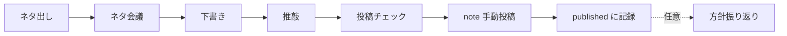

> Plan: _(fill after `dev-plan` creates `docs/plans/…`)_

# note 編集OS（編集長兼ライター）— Design

## 1. Problem

note アカウント [ぶあ＠タイ人と国際結婚](https://note.com/bua_thai) で、投稿文の質と中長期の方向性を一人で回している。やりたいことは「書く」だけでなく、**ネタ出し・ネタ会議・下書き・推敲・投稿チェック・方針相談**まで含めた編集長業務だが、資産と手順が散らばりやすい。

## 2. Goals / Non-goals

### Goals

- Cursor/Claude 上で **編集長兼ライター** として方針相談から投稿前チェックまで対話できる。
- プロフィール・方針・ネタ・下書き・公開メモを **このリポの markdown に資産化**する。
- いまは **ファン育成**、将来は **マネタイズ**。信頼できる実用メディアを目指す。
- タイ固有ネタに閉じず、**国際結婚の文化・価値観ギャップ**へ抽象化する編集ルールを守る。
- 週1本目安のリズムを、無理な週はスキップ可能な形で支える。

### Non-goals (v1)

- note API による自動投稿・予約投稿。
- Discord / Web UI の運用ボード（必要になったら別仕様）。
- vibe-post 級のフル自動リサーチ／レビューパイプライン。
- 有料記事・メンバーシップの課金実装（方針メモのみ先置き可）。
- タイ語コンテンツの制作。

## 3. Users

| 役割 | 誰 | 使い方 |
|------|-----|--------|
| 発行人兼編集長兼ライター | ぶあ（本人） | Cursor で方針相談・会議・執筆。リポが正本 |
| 読者（ペルソナ） | 国際結婚（検討含む）の日本人側 | note 上で記事を読む。システム直接利用者ではない |

## 4. Editorial strategy (locked)

| 項目 | 決定 |
|------|------|
| アカウント | https://note.com/bua_thai — 表示名「ぶあ」 |
| いまの目的 | ファンを育てる |
| 将来の目的 | マネタイズ（信頼・ためになるメディアが前提） |
| 読者 | 国際結婚（予定・検討中含む）の日本人側 |
| ポジション | 国際結婚の文化差・夫婦の考え方の差。タイは「私らしさ」の実例色 |
| 抽象化ルール | タイトル・テーマは国名に依存しない。各記事は必ず **国際結婚全般に効く学び** で締める |
| トーン | 体験談ベースの話し言葉。共感・あるあるが先、学びは自然に後から |
| プライバシー | 自分・パートナー・相手家族の実体験は書いてよい。**実名・顔・個人特定情報は出さない** |
| ペース | 週1本目安（スキップ可） |
| メッセージ | 文化や価値観の違いを楽しもう |

### Content pillars

| 優先 | 柱 | 例 |
|------|-----|-----|
| 主 | 文化・価値観ギャップあるある | 考え方の違いを楽しむ話 |
| 副 | 手続き・制度あるある | つまずき → 一般化できる学び |
| 副 | 役割分担・夫婦の意思決定 | 思いつき／計画／誰が動くか |

## 5. Author profile (public-safe)

リポの `profile/` に保持する初期値（公開してよい範囲）:

| 項目 | 内容 |
|------|------|
| 呼び方 | ぶあ |
| 立場 | タイ人の夫と結婚している日本人側 |
| 関係 | 結婚丸2年（出せる範囲） |
| 拠点 | 日本・神奈川県（市区町村は出さない） |
| 執筆上の「私」 | 手続き担当、夫の思いつきに振り回されがち、旅行計画も自分 |
| 伝えたいこと | 文化や価値観の違いを楽しもう |

## 6. Approach

**編集OS（markdown ＋ Cursor）** — 知識と下書きをリポに置き、対話で編集長／ライター役を果たす。UI・自動投稿は後回し。

近縁の `vibe-post`（Facebook／ペルソナ自動執筆）は参考に留め、**流用しない**（媒体・言語・目的が異なる）。

## 7. Repository layout

```text
notebook/
├── profile/
│   ├── author.md          # 公開してよいプロフィール
│   ├── voice.md           # 文体・言い回し・禁止トーン
│   └── privacy.md         # 匿名化ルール・出してよい／いけない
├── strategy/
│   ├── north-star.md      # ファン→マネタイズ、読者、メッセージ
│   ├── pillars.md         # 三本立ての定義と比率目安
│   └── monetization.md    # 将来メモのみ（実装なし）
├── editorial/
│   ├── idea-bank.md       # ネタ帳（柱タグ付き）
│   ├── calendar.md        # 週次予定・スキップ記録
│   └── meetings/          # ネタ会議ログ（1ファイル1回）
├── drafts/
│   ├── _template.md       # 下書きテンプレ（学び締め必須欄）
│   └── YYYY-MM-DD-slug.md # 作業中原稿
├── published/
│   └── YYYY-MM-DD-slug.md # URL・要約・学び・柱・反応メモ
└── prompts/
    ├── editor-in-chief.md # 方針相談・ネタ会議・選定
    ├── writer.md          # 下書き
    └── reviser.md         # 推敲・投稿チェック
```

`docs/`（Luna の SYSTEM_DESIGN / PLANS 等）はプロジェクトメタ用。上記コンテンツ資産とは分離する。

## 8. Weekly workflow



| 段階 | 編集長の仕事 | 成果物 |
|------|--------------|--------|
| ネタ出し | 柱に沿って候補追加 | `editorial/idea-bank.md` |
| ネタ会議 | 1本選定。角度・学び・タイ実例の出し方 | `editorial/meetings/…` |
| 下書き | `profile/` + `prompts/writer` で執筆 | `drafts/…` |
| 推敲 | 抽象化・学び締め・匿名化・トーン | 同ファイル更新 |
| 投稿チェック | タイトル／冒頭／NG／学び欄 | チェックリスト合格 |
| 公開後 | URL と学びを残す。反応は任意 | `published/…` |

## 9. Draft contract

各下書きは最低限次を持つ（テンプレで強制）:

1. **作業メタ** — 柱（主/副）、想定読者の悩み、ステータス（idea／draft／revise／ready）
2. **タイトル案** — 国名に依存しないこと（自己チェック欄）
3. **本文** — 話し言葉・体験フック優先
4. **タイ実例の扱い** — 使う／使わない、使う場合の匿名化メモ
5. **国際結婚全般に効く学び** — 必須。ここが空なら ready にしない
6. **投稿チェック** — プライバシー／抽象化／トーン／note体裁のチェックリスト

## 10. Prompt roles (behavior)

| プロンプト | やってよいこと | やってはいけないこと |
|------------|----------------|----------------------|
| 編集長 | 方針相談、柱バランス、ネタ選定、中長期の話 | いきなり長文を量産して会議をスキップ |
| ライター | 声とプロフィールに沿った下書き | 実名／特定情報、タイ話で終わる締め |
| 推敲 | 抽象化・学び・匿名化・冗長カット | トーンを編集者調に書き換えすぎる |

## 11. Success criteria (v1)

- [ ] 上記ディレクトリとテンプレ／プロンプトがリポに揃い、週次フローを1周できる。
- [ ] 新規下書きが「学び締め」「国名非依存タイトル」チェックなしでは ready にできない。
- [ ] プロフィール・プライバシーが文書化され、執筆時に参照される。
- [ ] 公開後メモを1本以上残せる形になっている。
- [ ] 方針相談（ファン→マネタイズ、柱比率）を Cursor 上で再開できる。

## 12. Open questions (defer)

- 柱の本数比率（例: 主7 : 副2 : 副1）の初期値 — 最初の4本のあと編集会議で決める。
- note のハッシュタグ／マガジン運用 — 投稿チェックに後から追加。
- 既存 note 記事の取り込み方法（手要約 vs コピペ）— 実装計画時に決める。

## 13. Implementation hint (for `dev-plan`)

実装は **ファイル雛形とプロンプト文書が本体**。アプリコードは v1 不要。`AGENTS.md` に編集フローへの導線を短く足す。`docs/SYSTEM_DESIGN.md` / `PROJECT_STRUCTURES.md` を本仕様に合わせて更新する。
